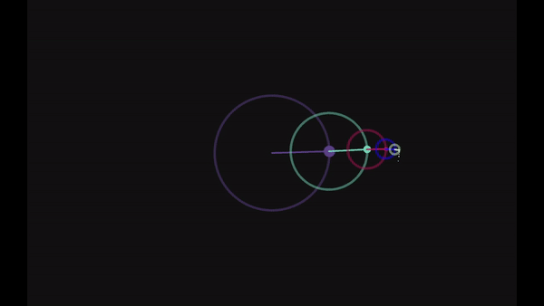

# SimpleFourierKivy
Very simple fourier series visualization using kivy. Still a WIP.



## What is this?
This repo is just an exercise in using Kivy, specifically events and rotation matrices in kvlang. The Fourier Series always fascinated me and was a key factor early on for me to learn programming. The beauty of the series eluded me for ages until I finally decided to visualize it. The logic within the code is based on an ancient piece of code I wrote during my undergrad days but adapted into a kivy-friendly format. Don't expect this to be a perfect representation of the Fourier series since I have implemented some shortcuts to make the visualization a bit more "nice" to look at.

## How to use
Go into the ```stuff.kv``` file and at the end you will see a series of ```CircleFreq``` objects. Simply set each ```CircleFreq```'s radius and freq and run the ```PloutFourier.py``` file! Keep in mind that the code resets the trace based on ```c1```'s frequency, so make sure the first ```CircleFreq``` is your fundamental frequency for the full trace to be drawn correctly.

## Future work
For sure the first step is to fix some of the weird kinks that occurred due to the shortcuts I took to get the circles to rotate correctly. Another thing to approach is adding buttons to dynamiccaly set new circles, their frequencies, and their radi easily and without editing the code. Also, a plot of the resultant sinusoidal is necessary but I am still figuring it out! 
